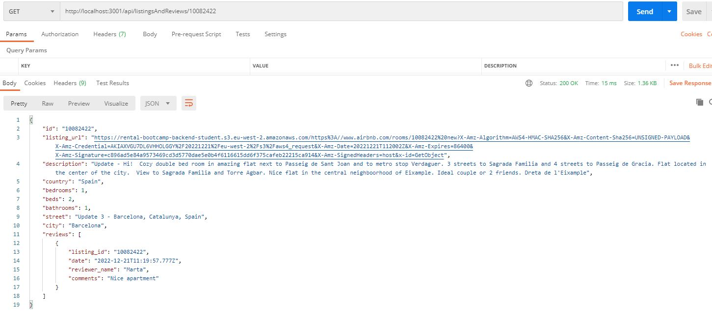

# Introduction
The aim of this repository is to deploy in the cloud the Api rest backend application implemented in this [repository](https://github.com/monicacrespo/bootcamp-backend-student-rest-api-rentals) without the authentication/authorization funcionality. 

The following section will show you the steps for deploying manually an application to production on a PaaS (platform as a service) like Heroku.

Heroku is a platform as a service (PaaS) that enables developers to build, run, and operate applications entirely in the cloud.

# Manual deployment with mock data to Heroku
First we need to create a production bundle of the api rest backend application.
On your back folder's terminal, follow these steps: 

1. Run `npm install` to install all the packages:
2. Install rimraf library to clean dist folder before run a new build and cross-env to create inline env variable: `npm install rimraf cross-env --save-dev`
3. Create a new npm command to compile ts into js files using babel. For that, change the `./back/package.json` by adding the `clean`, `build` and `build:prod` scripts as follows:

    ```
    "scripts": {
        ...
        "test:watch": "npm run test -- --watchAll -i",
        "clean": "rimraf dist",
        "build": "npm run type-check && npm run clean && npm run build:prod",
        "build:prod": "cross-env NODE_ENV=production babel src -d dist --extensions \".ts\""
    }
    ```

4. Build it: `npm run build`. This will create a `dist` folder with the  production version of the rest api rentals app. You could run it using node like this: `node dist/index.js`.
	
Then, we need to deploy the app to Heroku.
1. On Heroku website:
    * Create a new application, e.g. `manual-deployment-mock` and follow the steps listed [here](https://github.com/Lemoncode/bootcamp-backend/tree/main/00-stack-documental/05-cloud/02-deploy/02-manual-heroku-deploy).

    * Once the application has been created, add config vars on Heroku. Config vars are exposed to your app's code as environment variables. To do so, go to the "Settings" page, scroll until you see the "Config Vars" section. 
    
        Click on "Reveal Config Vars" and add the following variables:
 	    - API_MOCK = true
    	- STATIC_FILES_PATH = "./public"
    	- CORS_ORIGIN = false
    	- AUTH_SECRET = YOUR_SECRET
    
    * Go to the "Deploy" page and click on the `Heroku Git` icon.

2. In your local machine, in another folder outside back application:
    * Install the Heroku CLI

        To give access to the `Heroku Git` app repository, install globally heroku cli: `npm install -g heroku`

        If you haven't already, log in to your Heroku account with this command: `heroku login`

    * Clone to your local machine the repository generated on Heroku once the `manual-deployment-mock` application has been created: `git clone <yourHerokuGitUrl> .`

        To get `yourHerokuGitUrl` go to Heroku website, choose your app > Settings > App Information.

3. Deploy your changes to Heroku using Git
    1. Copy all necessary files to the code you just cloned:
		* dist folder content, except console-runners
		* public folder
		* package.json:
            - Delete all the "scripts" commands and add: `"start": "node index"`
            - Delete the "devDependencies" object. Heroku will install production dependencies before start the server.
	
	2. Create new `.gitignore` file, to ignore the `node_modules` folder, just in case heroku is performing the `npm i`

        Result:
        ```
        |- common/
        |- common-app/
        |- core/
        |- dals/
        |- pods/
        |- public/
        |- .gitignore
        |- app.js
        |- index.js
        |- package.json
        ```
    2. Deploy it
        ```
        git add .
        git commit -m "deploy app"
        git push
        ```

The application just deployed can be found in this [URL](https://rental-manual-deployment-mock.herokuapp.com/api/listingsAndReviews)

# AWS S3 storage
To consume the images of the houses from S3 Amazon, follow these steps:
1. On AWS S3 portal, 
    * First we need tp create a [bucket](https://docs.aws.amazon.com/AmazonS3/latest/userguide/creating-bucket.html). This bucket name should be unique for all amazon s3 accounts (not only ours) and it should follow some [rules](https://docs.aws.amazon.com/AmazonS3/latest/userguide/bucketnamingrules.html). The region is important too.

        Keep the default settings of the bucket and its objects to not have any public access.
 
        To provide credentials for our S3 bucket and objects we will create a custom user with IAM service with credentials. It will be valid for backend apps where we can provide credentials in a secure way. To get your IAM user and its Security credentials (access key ID and secret access key), please follow the instructions [here](https://docs.aws.amazon.com/sdk-for-go/v1/developer-guide/setting-up.html).

        More info [here]( https://github.com/Lemoncode/bootcamp-backend/tree/main/00-stack-documental/05-cloud/01-storage/02-s3-portal).

    * Upload house's images from public folder into the bucket.

    Along with the IAM user, we are going to create signed urls with expiration time and send it to web-clients.

2. On your back folder's bash terminal, follow these steps:
    * Run `npm install @aws-sdk/client-s3 --save` to install the official aws-sdk v3 library. In the v3, it was published different packages to npm for example for s3-client.
    * Run `npm install @aws-sdk/s3-request-presigner --save` to generate a presigned URL programmatically. More information [here](https://docs.aws.amazon.com/sdk-for-go/v1/developer-guide/s3-example-presigned-urls.html).

        
 
3. On Heroku website add config vars. To do so, go to the "Settings" page, scroll until you see the "Config Vars" section. 
    
    Click on "Reveal Config Vars" and add the following variables:
    - AWS_ACCESS_KEY_ID (aws key id)
    - AWS_SECRET_ACCESS_KEY (aws access key)
    - AWS_S3_BUCKET (name of the aws bucket)