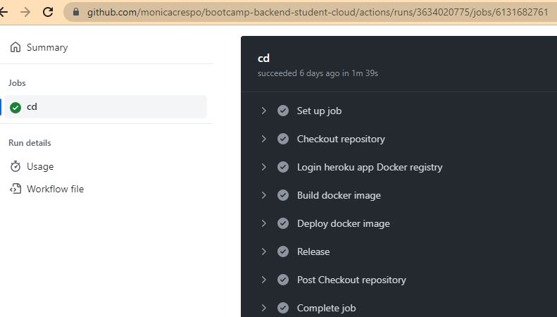

# Introduction
The aim of this repository is to deploy in the cloud the Api rest backend application implemented in this [repository](https://github.com/monicacrespo/bootcamp-backend-student-rest-api-rentals) without the authentication/authorization funcionality. 


Aqui ya directamente se puede conectar con el MongoDB Atlas creado en el paso anterior.
Crear todos los ficheros necesarios para poder realizar un despliegue automático.
Dejar en el readme la URL de la aplicación desplegada.


# Automatic deployment to Heroku with production data in MongoDB Atlas
Once we have got the app deployed in Heroku with a production database in MongoDB Atlas and it's working, we will use Github Actions as pipeline to deploy the app automatically to Heroku.

First, we will create a different application on Heroku website with the same config vars than the Heroku app with mongodb:
  - API_MOCK = false
  - STATIC_FILES_PATH = "./public"
  - CORS_ORIGIN = false
  - AUTH_SECRET = "yourauthsecret"
  - MONGODB_URI = "yourmongodbUri"

Then we will use Github Actions as pipeline to deploy the app to Heroku. You could follow the steps listed [here](https://github.com/Lemoncode/bootcamp-backend/tree/main/00-stack-documental/05-cloud/02-deploy/08-auto-heroku-deploy).
   
./.github/workflows/cd.yml

```
name: Continuos Deployment Workflow

on:
push:
    branches:
    - automated-deployment

env:
HEROKU_API_KEY: ${{ secrets.HEROKU_API_KEY }}
IMAGE_NAME: registry.heroku.com/${{ secrets.HEROKU_APP_NAME }}/web

jobs:
cd:
    runs-on: ubuntu-latest
    steps:
    - name: Checkout repository
        uses: actions/checkout@v3
    - name: Login heroku app Docker registry
        run: heroku container:login
    - name: Build docker image
        run: docker build -t ${{ env.IMAGE_NAME }} .
    - name: Deploy docker image
        run: docker push ${{ env.IMAGE_NAME }}
    - name: Release
        run: heroku container:release web -a ${{ secrets.HEROKU_APP_NAME }}
```


GitHub CD Workflow



This is the Dockerfile used to build the docker image.

```
FROM node:16-alpine AS base
RUN mkdir -p /usr/app
WORKDIR /usr/app

# Build back app
FROM base AS back-build
COPY ./back ./
RUN npm install
RUN npm run build

# Release
FROM base AS release
COPY --from=back-build /usr/app/dist ./
COPY ./back/package.json ./
COPY ./back/package-lock.json ./
RUN npm ci --only=production

ENV PORT=3001
ENV NODE_ENV=production
ENV STATIC_FILES_PATH=./public
ENV API_MOCK=true
ENV CORS_ORIGIN=false

ENTRYPOINT ["node", "index"]
```
Note that uses multi-stage builds to decrease this size, with only the necessary info


The application just deployed can be found in this [URL](https://rental-automated-deployment.herokuapp.com/api/listingsAndReviews).

# AWS S3 storage
  Please see the details in `manual-deployment-mock` branch.